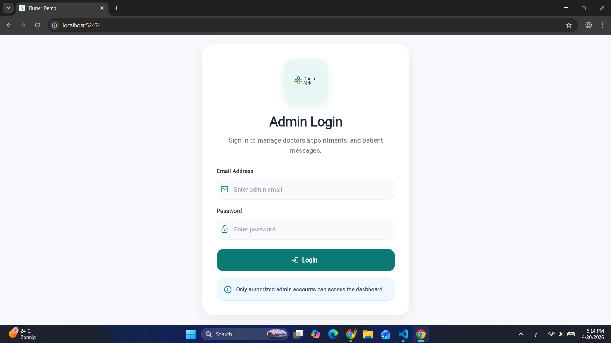
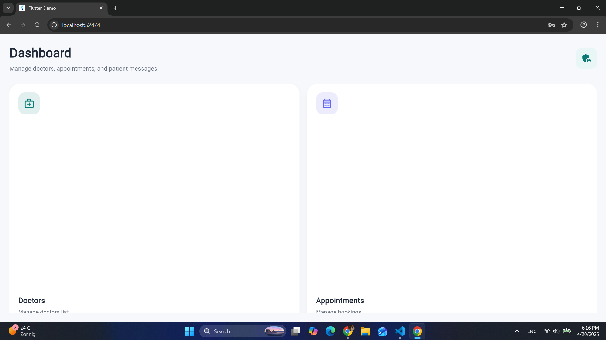
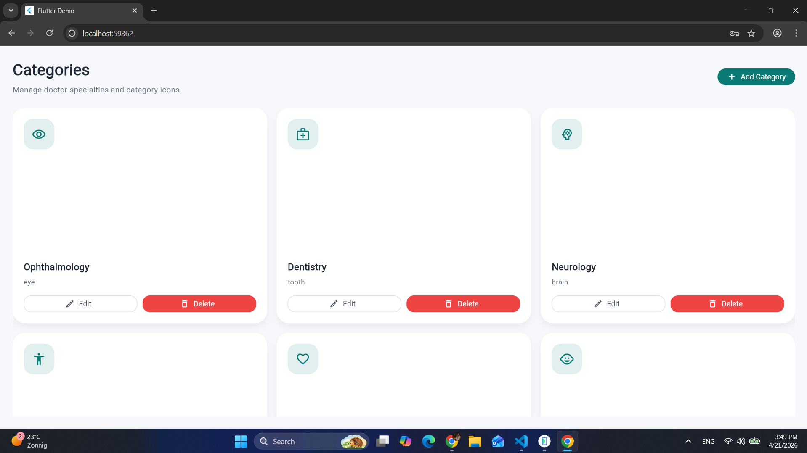
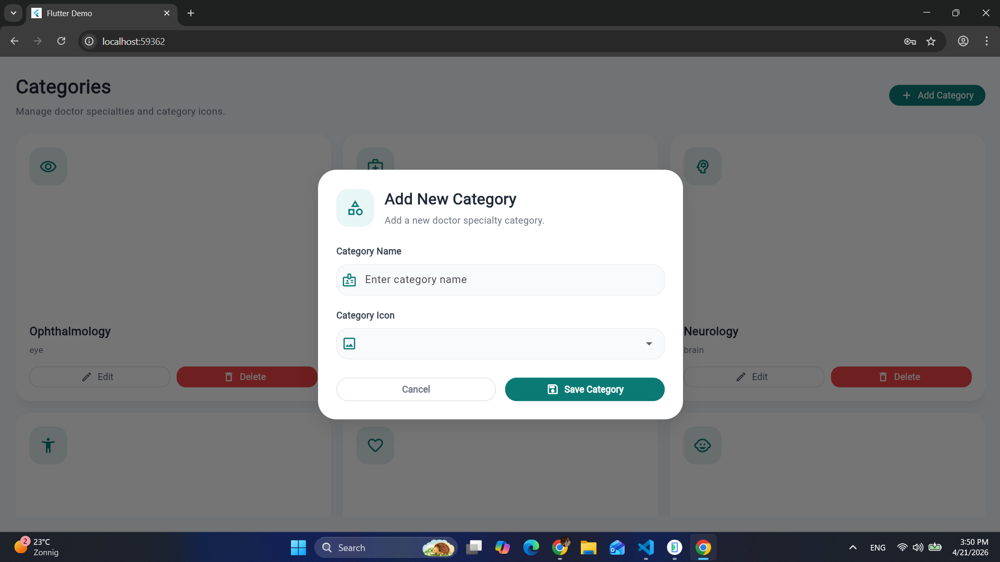
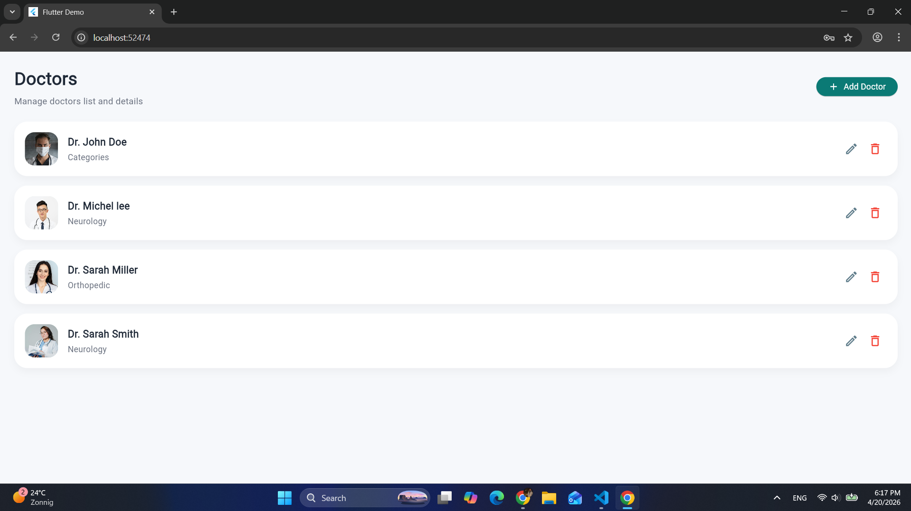
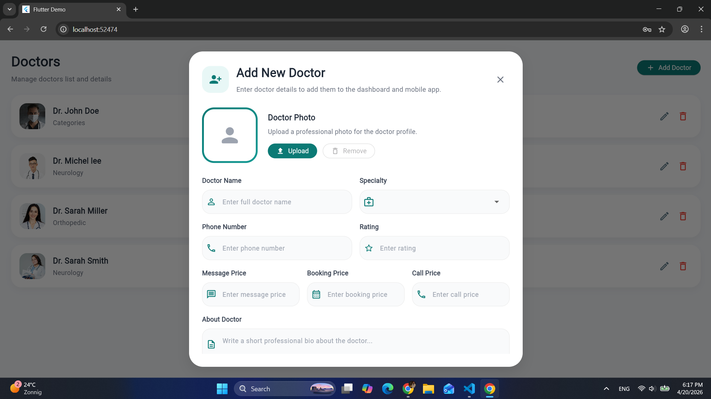
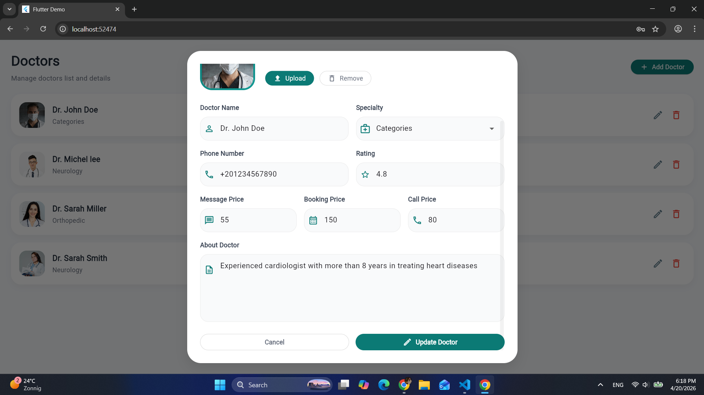
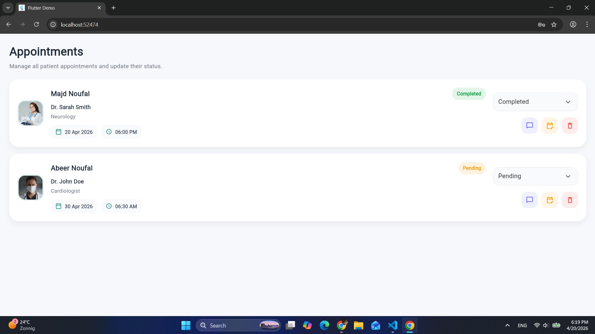
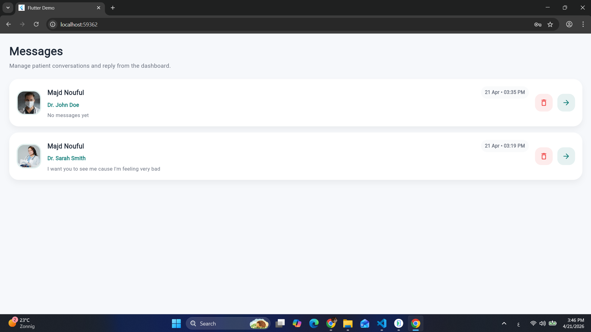
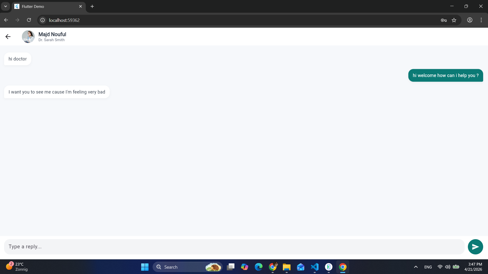

# 🩺 Doctor Dashboard (Admin Panel)

A modern Flutter-based admin dashboard for managing a doctor appointment system.  
This dashboard allows administrators to manage doctors, categories, appointments, and chat with users in real-time.

---

## 📌 Overview

Doctor Dashboard is the backend control panel for the Doctor Appointment App.

It provides full control over the system, including managing doctors, handling appointments, organizing categories, and communicating with users through real-time chat.

Built with Flutter and Firebase, the dashboard ensures scalability, performance, and real-time synchronization with the mobile application.

---

## 🚀 Key Features

### 🔐 Authentication
- Admin login system  
- Secure access to dashboard  

### 🏠 Dashboard Home
- Overview of system data  
- Clean and modern UI  

### 🗂️ Categories Management
- Add new categories  
- View all categories  
- Organize medical specialties  

### 👨‍⚕️ Doctors Management
- Add doctors  
- Edit doctor details  
- View all doctors  
- Manage doctor data (name, image, specialty, etc.)  

### 📅 Appointments Management
- View all appointments  
- Real-time updates from mobile app  
- Manage appointment statuses  

### 💬 Chat System
- Real-time chat with users  
- Live message updates using Firestore  
- Conversations synced with mobile app  

---

## 🧰 Tech Stack

- Flutter  
- Dart  
- Firebase Authentication  
- Cloud Firestore  
- BLoC (State Management)  
- Material Design  

---

## 🏗️ Project Structure

```bash
lib/
├── core/
├── features/
│   ├── auth/
│   ├── dashboard/
│   ├── category/
│   ├── doctors/
│   ├── appointment/
│   └── message/
├── firebase_options.dart
└── main.dart

```
📸 Screenshots


🔐 Login Admin
<p align="center">  </p>
🏠 Dashboard Home
<p align="center">  </p>
🗂️ Categories
<p align="center">  </p>
➕ Add Category
<p align="center">  </p>
👨‍⚕️ Doctors Dashboard
<p align="center">  </p>
➕ Add Doctor
<p align="center">  </p>
✏️ Edit Doctor
<p align="center">  </p>
📅 Appointments Dashboard
<p align="center">  </p>
💬 Messages
<p align="center">  </p>
🗨️ Chat with User
<p align="center">  </p>


⚡ Real-Time Features
. Live appointment updates
. Real-time chat system
. Firestore synchronization
. Instant data reflection between dashboard and mobile app


🔮 Scalability & Future Improvements

This dashboard is designed to be extendable and production-ready.

. Multi-language support
. Dark / Light theme
. Push notifications
. Advanced analytics dashboard
. Role-based access control (Admin / Super Admin)
. File & image sharing in chat
. Search & filtering system
. Performance optimization


🔗 Integration

This dashboard is connected with the mobile application:

👉 Doctor Appointment App

. Manage doctors & categories
. Control appointments
. Chat with users in real-time


👨‍💻 Author

Majd Noufal
Flutter Developer 🚀
